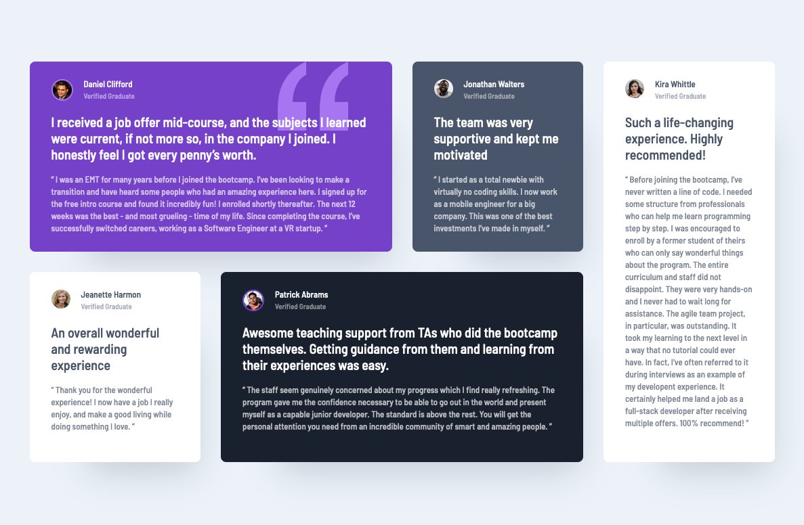

# Frontend Mentor - Testimonials grid section solution

This is a solution to the [Testimonials grid section challenge on Frontend Mentor](https://www.frontendmentor.io/challenges/testimonials-grid-section-Nnw6J7Un7). Frontend Mentor challenges help you improve your coding skills by building realistic projects. 

## Table of contents

- [Overview](#overview)
  - [The challenge](#the-challenge)
  - [Screenshot](#screenshot)
  - [Links](#links)
- [My process](#my-process)
  - [Built with](#built-with)
  - [What I learned](#what-i-learned)
  - [Continued development](#continued-development)
  - [Useful resources](#useful-resources)
- [Author](#author)

## Overview

### The challenge

This is simply testimonial section. I think that this should be starter challenge for everyone, who wants to begin with css grid. 

### Screenshot

### Links

- Solution URL: [Add solution URL here](https://your-solution-url.com)
- Live Site URL: [Add live site URL here](https://your-live-site-url.com)

## My process

### Built with

- Semantic HTML5 markup
- Sass
- Flexbox
- CSS Grid
- Mobile-first workflow

### What I learned

I made this solution because I wanted to practise working with CSS grid. This is nice little testimonial section.
For this grid, I used 'grid-template-areas'.

### Continued development

I take this as preparation for bigger challenge from FM with asymetric design - [Creative angency single-page site](https://www.frontendmentor.io/challenges/creative-agency-singlepage-site-Pq6V3I2RM/)

### Useful resources

- [CSS Grid tutorial](https://www.youtube.com/watch?v=plRcoRqLriw&list=PL4-IK0AVhVjPv5tfS82UF_iQgFp4Bl998) - I really love Kevins videos. This helped me to start with design.
- [Grid template areas docs](https://developer.mozilla.org/en-US/docs/Web/CSS/CSS_Grid_Layout/Grid_Template_Areas) - Everything you need to know :)

## Author

- Frontend Mentor - [@sirriah](https://www.frontendmentor.io/profile/sirriah)

